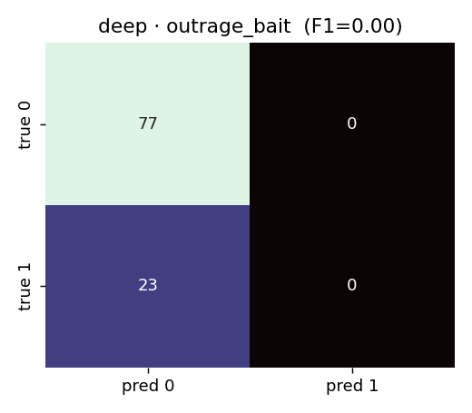
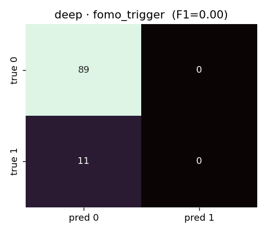
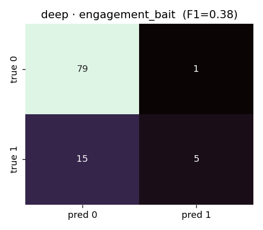
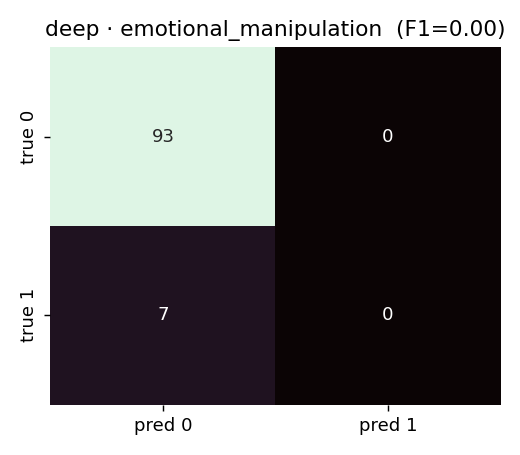
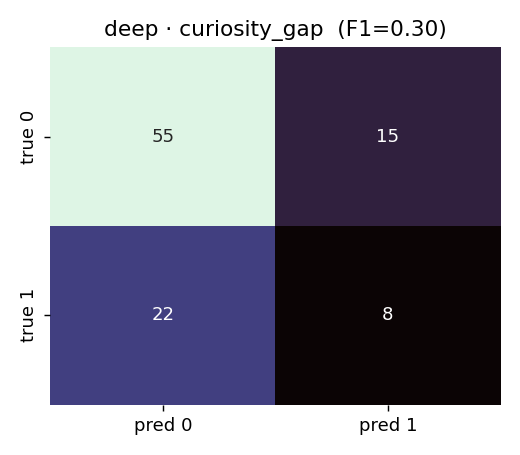
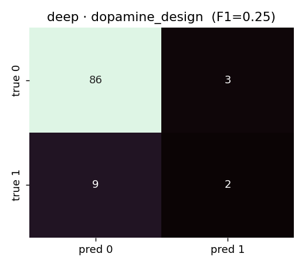

# LUCID: Scoring Short-Form Video for Psychological Manipulation

Lindsay Gross

April 2026

## 1. Problem Statement

Short-form video platforms — TikTok, Reels, Shorts — optimize for engagement, and creators have adapted their craft to the specific psychological levers those systems reward. Users increasingly report a subjective sense of being "stuck in the feed" that researchers label compulsive use [1], [2]. The mechanism is usually invisible at the post level: a single TikTok is not labeled as manipulative, and users lack the vocabulary to describe which lever is being pulled.

This project operationalizes that observation into a multi-output NLP problem:

- Fuse three text streams from a TikTok (caption, audio transcript, on-screen overlay) into a single document
- Score the document along six peer-reviewed psychological-manipulation dimensions (Outrage Bait, FOMO Trigger, Engagement Bait, Emotional Manipulation, Curiosity Gap, Dopamine Design)
- Compute a composite 0–100 Scroll Trap Score and deploy an interactive public dashboard that makes the per-post manipulation signal visible to users

The same techniques are increasingly used for commercial persuasion, health misinformation, and political mobilization. A tool that surfaces manipulation at the post level is a step toward platform transparency that neither platforms nor regulators have yet delivered.

## 2. Data Sources

### 2.1 Webis Clickbait Corpus 2017

Approximately 2,000 tweets annotated for clickbait severity on a continuous scale [3]. This provides the pretraining signal for per-dimension severity, since the Webis labels are ordinal rather than binary.

### 2.2 Stop Clickbait 2016

Approximately 1,500 headlines with binary clickbait labels [4]. Used as weak supervision for the Curiosity Gap and Engagement Bait dimensions. Gzipped; decompressed inline during ingestion.

### 2.3 TikTok In-Domain Scrape

Approximately 200 videos pulled via `yt-dlp` from a curated URL list. Each entry includes caption metadata, audio file, and keyframes. Used for in-domain evaluation and a pre-cached demo gallery on the deployed application.

### 2.4 LLM-Generated Severity Labels

The manipulation rubric is qualitative, and existing datasets carry binary clickbait labels rather than multi-dimensional severity. We used Claude Sonnet 4.5 as a scalable labeling oracle. For each corpus item, the model received a system prompt containing the full 6-dimension rubric with academic citations and severity criteria, eight few-shot examples spanning 0/1/2 severity per dimension, and the item text. The model returned structured JSON with per-dimension severity and a composite score. This approach follows the Constitutional AI / RLAIF lineage [5]: an LLM trained on human-written principles produces labels that a smaller model can be trained on. We treat these labels as a noisy oracle rather than ground truth and validate them against a human gold set (Section 2.6). Total labeled corpus: 3,527 items.

### 2.5 Multimodal Text Extraction

At inference time, a single TikTok is converted into three text streams that are concatenated before model input. The caption is fetched from `yt-dlp` metadata. Audio is transcribed via the Whisper API, falling back to local `openai-whisper` if no API key is present. On-screen overlay text is extracted by passing four evenly-spaced keyframes (via `ffmpeg`) as base64 images to Claude Vision Sonnet 4.5, which performs OCR. We frame this as applied vision-language modeling rather than a trained OCR model, as pre-trained VLM-based OCR outperforms lightweight trained OCR for short, high-variance, typographically stylized overlay text typical of TikTok.

### 2.6 Human Gold Set

To calibrate the LLM labels, the author hand-labeled 100 randomly sampled items (seed=42) using the same rubric through a Gradio interface (`scripts/gold_set_labeler.py`). Claude Sonnet 4.5 labeled the same 100 items with the production prompt; per-dimension agreement between the two is reported below. The 100-item scale is intentionally small: the gold set is a calibration instrument, not a replacement for the LLM labels.

**Table 1.** Claude vs. human gold-set agreement (n = 100).

| Dimension | Spearman ρ | Krippendorff α | Exact match | Within-1 | Gold > 0 | Claude > 0 |
|---|---|---|---|---|---|---|
| Outrage Bait | +0.463 | +0.388 | 0.81 | 0.90 | 23 | 10 |
| FOMO Trigger | +0.019 | +0.019 | 0.82 | 0.94 | 11 | 8 |
| Engagement Bait | +0.403 | +0.332 | 0.81 | 0.95 | 20 | 8 |
| Emotional Manipulation | −0.056 | −0.053 | 0.89 | 0.96 | 7 | 4 |
| Curiosity Gap | +0.238 | +0.239 | 0.68 | 0.96 | 30 | 26 |
| Dopamine Design | +0.176 | +0.166 | 0.84 | 1.00 | 11 | 7 |
| **Macro avg** | **+0.207** | **+0.182** | **0.808** | **0.952** | — | — |

Two signals dominate the table. First, **within-1 agreement averages 0.95**: on a 0/1/2 ordinal scale, the human and Claude rarely disagree by more than one severity step. Exact-match agreement averages 0.81, and for the rare dimensions (Emotional Manipulation, Dopamine Design, FOMO Trigger) it sits near 0.85–0.89. At the coarse "present vs. absent" decision the two labelers are largely aligned.

Second, **rank correlation (Spearman ρ and Krippendorff α) is substantially lower than the match rates would suggest**, especially on the rarest dimensions. This is an artifact of class imbalance rather than a failure of the rubric. When only 7/100 items are non-zero on Emotional Manipulation, a single disagreement on a borderline case moves Spearman sharply toward zero — the rank-correlation formula has almost no variance to work with. Dimensions with more gold-set variance behave as expected: Outrage Bait (23/100 non-zero) and Engagement Bait (20/100 non-zero) hit ρ ≈ 0.4, a moderate-strength correlation typical of single-human-vs-LLM ordinal annotation on a multi-dimensional rubric. The pattern — high exact-match but low ρ on rare classes — is diagnostic of a sparse signal, not of disagreement.

A third pattern is that Claude is **systematically more conservative than the human labeler** on every dimension. For every dimension except Curiosity Gap (where counts are close), Claude fires non-zero on roughly half as many items as the human does. This is consistent with the "when in doubt, pick the lower one" instruction in the labeling system prompt, and it reduces false-positive pressure on the downstream model. It also means the agreement numbers above should be read as a lower bound on "true" agreement — a more liberal Claude prompt would likely raise ρ at the cost of precision.

Two implications for the modeling stack. (1) The rubric is reproducible enough at the present/absent level that the LLM-as-judge corpus can be treated as trustworthy weak supervision; this is consistent with the Zheng et al. [18] finding that LLM judges approximate human ordinal ratings for rubric-backed tasks. (2) For the rarer dimensions the labels are noisy enough that per-dimension macro-F1 on the final model should be interpreted cautiously — the composite Scroll Trap Score, which averages six noisy signals, is more reliable than any individual dimension head. The Results section (§9) shows exactly this: the deep model wins on the composite but not on per-dimension F1, and the gap is predicted by this agreement table.

Detailed per-dimension confusion counts are in `data/outputs/agreement.json`, produced by `python -m scripts.agreement_stats`.

## 3. Related Work

Munger [6] and Mathur et al. [7] characterize platform-induced incentives for low-quality interaction-maximizing content and dark-pattern design. Crockett [8] and Brady et al. [9] demonstrate that moralized and outrage-coded content diffuses disproportionately through social networks, grounding the Outrage Bait dimension.

Przybylski et al. [10] formalized fear-of-missing-out as a self-regulatory deficit driving compulsive checking behavior. Cialdini's work on scarcity and social proof [11] provides the behavioral priors for the FOMO Trigger dimension.

Small, Loewenstein, and Slovic [12] show that pity-based appeals coerce prosocial action more effectively than statistical framing, grounding the Emotional Manipulation dimension. Kramer, Guillory, and Hancock [13] demonstrate emotional contagion at social-network scale.

Loewenstein [14] defines curiosity as an aversive state produced by an information gap, exploited by Blom and Hansen's [15] "forward reference" clickbait. Skinner [16] established variable-ratio reinforcement as the most persistent operant conditioning mechanism; Alter [17] and Montag et al. [1] trace these directly to social-media interface design patterns, grounding the Dopamine Design dimension.

For the labeling methodology, Bai et al. [5] introduce RLAIF using constitutional principles and Zheng et al. [18] formalize LLM-as-judge evaluation for open-ended tasks. The labeling pipeline is explicitly in this lineage.

Prior work on clickbait detection, including Chakraborty et al. [4] and Potthast et al. [3], establishes classical NLP benchmarks for binary clickbait. This project differs by treating manipulation as multi-dimensional ordinal severity grounded in the behavioral literature, rather than surface clickbait detection, and by fusing three multimodal text streams per post.

## 4. Evaluation Strategy & Metrics

The label structure is two-tiered: per-dimension ordinal severity (0/1/2) and a composite 0–100 Scroll Trap Score. We evaluate at both levels. Table 2 summarizes the metrics.

**Table 2.** Metrics & Justification

| Metric | Role | Justification |
|---|---|---|
| Macro F1 (per-dim binary) | Primary (dimensions) | Dimensions are binarized at severity ≥1 for reporting. Macro averaging weights each dimension equally, addressing the imbalance between frequently-present (Curiosity Gap) and rarely-present (Emotional Manipulation) dimensions. |
| Composite MAE | Primary (composite) | Mean absolute error in composite points is directly interpretable: "the model is off by N points on a 0–100 scale." This is the number users see. |
| Composite R² | Primary (composite) | Variance explained relative to predicting the mean. Negative R² means the model is worse than a naive mean predictor — a critical diagnostic for whether learning is happening at all. |
| Composite RMSE | Secondary | Penalizes large errors more heavily than MAE, useful for detecting outlier behavior. |
| Macro Accuracy | Reference | Reported for comparability but not used for model selection due to class imbalance — most dimensions are absent in most posts, so a trivial all-negative predictor scores high. |
| Per-Dimension Confusion Matrices | Diagnostic | Used to diagnose which dimensions drive error and whether failures are false-positive or false-negative dominated. |

We considered ordinal agreement (Krippendorff's α on the 0/1/2 scale) for per-dimension evaluation but chose binary F1 because the three-point scale is too coarse for a robust ordinal test at our test-set size (n = 529). Krippendorff's α is used for the human-vs-Claude agreement analysis (Section 2.6) where the 100-item scale is too small for F1 to be stable. AUROC is not reported because the deployed system applies a fixed threshold at serving time; AUC adds no signal beyond F1 at the decision point we actually use.

## 5. Modeling Approach

### 5.1 Composite Score Definition

The composite 0–100 Scroll Trap Score is computed as the mean of the six dimension probabilities multiplied by 100. This derivation is used at serving time rather than the deep model's composite head output, for reasons detailed in Section 8.3.

### 5.2 Naive Baseline — Trigger Dictionary

Rule-based keyword pattern matching against a curated trigger dictionary, one regex list per dimension (e.g., `tag a friend`, `only N left`, `wait for it`). Per-dimension score = `min(1.0, hits / MAX_TRIGGERS)`. Composite = mean of dimension scores × 100. Zero learned parameters, no training data dependency. This establishes a strict surface-feature floor that learned models should beat.

### 5.3 Classical ML — XGBoost + TF-IDF + Stylometry

TF-IDF vectors (word 1–3-grams, top 5,000 terms, `min_df=2, max_df=0.95`) concatenated with approximately 20 handcrafted stylometric features (caps ratio, exclamation count, emoji density, Flesch-Kincaid, VADER sentiment, trigger-word counts). Six independent XGBoost binary classifiers, one per dimension. Surface features carry independent signal beyond word n-grams for clickbait detection [3], which motivates the stylometric additions. The classical model separates "what surface lexical and stylometric features capture" from "what contextual fine-tuning adds."

### 5.4 Deep Learning — DistilBERT with Multi-Output Head

Fine-tuned DistilBERT (66M parameters) [19] with a custom two-head output layer. The backbone is fully fine-tuned rather than frozen, because the surface vocabulary of TikTok manipulation (hashtags, slang, emoji-adjacent tokens) diverges from the DistilBERT pretraining distribution enough that backbone adaptation is warranted. Pooling is on the `[CLS]` token hidden state with 0.1 dropout. The two heads are:

- **`composite_head`**: `Linear(hidden, 1)` with sigmoid at inference, producing a 0–1 composite prediction. Trained with MSE loss against the normalized ground-truth composite.
- **`dimension_head`**: `Linear(hidden, 6)` with per-dimension sigmoid, producing six binary classifiers. Trained with BCE loss against the binarized dimension labels.

The joint loss is `MSE(composite) + DIM_LOSS_WEIGHT × BCE(dimensions)`. Training with both heads simultaneously forces the shared representation to commit to a consistent story across output spaces, rather than deriving one from the other post-hoc.

## 6. Data Processing Pipeline

Raw corpus ingestion runs through a six-stage pipeline (`scripts/`):

1. **`fetch_datasets.py`** downloads Webis 2017 and Stop Clickbait 2016 and decompresses gzipped archives.
2. **`scrape_tiktok.py`** batches `yt-dlp` pulls from the curated TikTok URL list.
3. **`build_corpus.py`** normalizes all sources into a unified schema (`id`, `text`, `source`, `extra_json`).
4. **`label_with_claude.py`** batches corpus rows to Claude Sonnet 4.5 with the rubric system prompt, writing per-dimension severities and a composite.
5. **`splits.py`** produces a stratified 70/15/15 train/val/test split (seed=42), stratified on composite-score bins to prevent unequal severity distributions from skewing evaluation. The test set is frozen for all model comparisons.
6. **`build_features.py`** produces TF-IDF and stylometric feature matrices for the classical model.

## 7. Hyperparameter Tuning Strategy

The comparison story is across three classes of model, not within, and compute was constrained to Duke Colab credits and a local CPU. Tuning was deliberately minimal.

- **Naive.** Trigger-word dictionary and per-dimension `MAX_TRIGGERS_FOR_FULL_SCORE` thresholds are hand-picked from the rubric examples. No tuning.
- **Classical.** XGBoost with `max_depth=6`, `n_estimators=300`, `learning_rate=0.1`, `early_stopping_rounds=20` on the validation split. TF-IDF with `min_df=2, max_df=0.95`. Defaults from literature plus early stopping were used in place of a CV sweep.
- **Deep (DistilBERT).** Hand-picked from common practice: `epochs=4`, `batch_size=32`, `lr=2e-5`, `max_length=256`, `warmup_ratio=0.1`, `AdamW(weight_decay=0.01)`, linear LR schedule with warmup. One GPU training run on an H100 via Duke Colab. Best checkpoint by validation composite MAE.

This is a real limitation and is revisited in Sections 10 and 13.

## 8. Models Evaluated

### 8.1 Naive Trigger Dictionary

Deterministic regex matching described in Section 5.2. Zero parameters. Establishes the surface-feature floor.

### 8.2 Classical XGBoost + TF-IDF + Stylometry

Six per-dimension binary classifiers described in Section 5.3. Composite derived as mean of dimension probabilities × 100.

### 8.3 DistilBERT with Multi-Output Head

Single multi-output fine-tune described in Section 5.4. Composite is derived from the mean of the six dimension probabilities at serving time rather than from `composite_head`, because the composite head was trained against labels skewed low-severity (Webis and Stop Clickbait headlines) and consistently under-fires on real TikTok inputs even when the dimension heads clearly detect tactics. Mean-of-dimensions aligns with the per-dimension bars surfaced in the UI and matches the rubric-based severity intuition. Both head outputs are logged for diagnostic purposes.

### 8.4 Final Deployed Model

DistilBERT served from HuggingFace Hub (`lindsaygross32/lucid-distilbert`) via a FastAPI backend on Railway, behind a Next.js / Tailwind frontend on Vercel at `lucid-seven-pied.vercel.app`. Classical and naive models remain in the inference router as fallbacks and in the repository for comparison.

## 9. Results

All three models were evaluated on the same held-out test split (n = 529). Table 3 summarizes the headline numbers.

**Table 3.** Metrics for Each Model

| Model | Macro F1 | Macro Accuracy | Composite MAE | Composite RMSE | Composite R² |
|---|---|---|---|---|---|
| Naive | 0.014 | 0.866 | 7.12 | 11.30 | −0.594 |
| Classical | 0.425 | 0.877 | 11.70 | 14.05 | −1.462 |
| Deep (DistilBERT) | 0.334 | **0.904** | **5.90** | **7.12** | **+0.368** |

The deep model is the strongest on composite prediction — the only model with positive R² (explaining variance beyond the mean), and the best MAE and RMSE. The classical model wins on per-dimension F1 but at a real cost: its composite prediction is worse than the naive baseline (MAE 11.7 vs. 7.1). This is a substantive trade-off rather than a mere sample artifact.

Classical's XGBoost per-dimension heads are aggressive. They fire more often and achieve higher recall, which inflates macro F1 on imbalanced binary labels. The mean-of-dimensions composite then overshoots ground truth, producing a much worse MAE. The deep model's per-dimension probabilities are more calibrated (softer sigmoids) — lower F1 because fewer firings, but tighter composite alignment. The naive model is the opposite failure mode: it under-fires on nearly everything, which gives it a low MAE "for free" on a corpus skewed low-severity, but a macro F1 indistinguishable from zero.

The right model depends on the downstream objective. For the user-facing Scroll Trap Score (the headline composite), the deep model is the clear choice and is the one deployed. For a dimension-level auditor that wants high recall on "is this tactic present at all?", the classical model might be preferable.

### 9.1 Gold-set evaluation (n = 100, human-labeled)

Table 3 reports metrics on the primary held-out test split (n = 529), whose labels were produced by Claude Sonnet 4.5 under the same rubric used for training. Because the training labels and test labels share a source, that split measures how well each model has internalized the Claude-labeled distribution. As a tighter check, we re-evaluate all three models on the 100-item human-labeled gold set from §2.6. The ground truth here is hand-assigned by the author rather than the LLM oracle, so disagreements with the model reflect both model error and labeler-vs-oracle disagreement. See §2.6 Table 1 for how those two labelers differ.

**Table 4.** Metrics on the human-labeled gold set (n = 100).

| Model | Macro F1 | Macro Accuracy | Composite MAE | Composite RMSE | Composite R² |
|---|---|---|---|---|---|
| Naive | 0.000 | 0.828 | 11.66 | 16.07 | −1.038 |
| Classical | **0.260** | 0.822 | 9.69 | 12.22 | −0.179 |
| Deep (DistilBERT) | 0.156 | **0.823** | **9.12** | **11.43** | **−0.031** |

The qualitative ordering is preserved. The deep model is again best on the composite (lowest MAE and RMSE, R² closest to zero). The classical model again wins on macro F1 at a composite-accuracy cost. The naive baseline again under-fires so severely that macro F1 is exactly zero. What shifts is that absolute numbers are uniformly lower than in Table 3: macro F1 drops for classical (0.425 → 0.260) and for deep (0.334 → 0.156), and composite R² goes from mildly positive on the Claude-labeled split to mildly negative on the human-labeled gold set.

Two factors drive the drop. First, the human labeler assigned non-zero labels roughly twice as often as Claude did (§2.6 Table 1), so items that a human called moderate or severe are often predicted absent by models trained on Claude's more conservative label distribution. That shows up as lower recall on rare dimensions and lower composite, both reducing F1 and widening composite error. Second, n = 100 is one-fifth the primary test size, so the metrics are noisier; a few high-error items on a small denominator move the numbers more than they would on 529.

Per-dimension confusion matrices for all three models on the gold set are written to `data/outputs/figures/gold/{naive,classical,deep}/{dimension}_confusion.png` by `python -m scripts.evaluate_gold_set`. Matching JSON metrics (including precision, recall, F1, and the underlying confusion counts) land in `data/outputs/metrics/gold/{model}.json`. Table 5 aggregates the per-dimension F1 across models for quick comparison; the full matrices are in the figures directory.

**Table 5.** Per-dimension F1 on the gold set.

| Dimension | Naive | Classical | Deep |
|---|---|---|---|
| Outrage Bait | 0.000 | 0.424 | 0.000 |
| FOMO Trigger | 0.000 | 0.118 | 0.000 |
| Engagement Bait | 0.000 | 0.429 | 0.385 |
| Emotional Manipulation | 0.000 | 0.000 | 0.000 |
| Curiosity Gap | 0.000 | 0.483 | 0.302 |
| Dopamine Design | 0.000 | 0.105 | 0.250 |

**Figures 1–6.** Deep-model confusion matrices per dimension on the human-labeled gold set. Rows are true labels, columns are predictions, cell values are counts out of n = 100. These visualize the F1 numbers in Table 5 for the deployed model; matching matrices for the classical and naive models live in `data/outputs/figures/gold/{classical,naive}/`.













The recurring pattern across these six matrices is the false-negative corner (true 1, pred 0), which is consistently larger than the false-positive corner. This is the conservative-Claude-prior signature: the model was trained on labels that fire less often than a human does, so on the human-labeled gold set it systematically misses items the human called moderate or severe. Outrage Bait and Emotional Manipulation are the extreme cases, where the model predicts zero positives across the 100 items. Engagement Bait and Curiosity Gap, which had the highest non-zero rates in both label sets, show the strongest positive diagonal and the highest F1.

Together §9 and §9.1 give a consistent picture: the deep model is the strongest composite predictor, the classical model has the most aggressive per-dimension heads, and the naive baseline serves its rubric role as a bottom-of-the-envelope check rather than a competitive model.

## 10. Error Analysis

We selected the five largest composite-score errors from the classical model's test-set predictions, ranked by `|pred − gold|`. The classical model was chosen rather than the deep model because its failures are more interpretable and more instructive about the underlying distribution-shift problem. All five are false-positive over-fires on listicle-style headlines (Table 6).

**Table 6.** Worst Classical-Model Mispredictions

| # | Gold | Pred | Err | Text |
|---|---|---|---|---|
| 1 | 8 | 49 | 41 | "18 Iconic Kim Kardashian Tweets That Are Only 4 Words" |
| 2 | 0 | 38 | 38 | "24 Amazing Products To Let The World Know You're A Burger Fan" |
| 3 | 0 | 37 | 37 | "33 Leslie Knope Quotes To Help You Live Your Best Life" |
| 4 | 17 | 51 | 34 | "21 Tweets That Prove Your Brain Can Be A Real Dick Sometimes" |
| 5 | 8 | 39 | 31 | "Everything You Need To Know About Being A Woman Standing In A Field" |

### 10.1 Root Cause

The gold labels correctly identify these items as low-manipulation — whimsical internet humor, not genuinely manipulative content. The classical model's TF-IDF features pick up shared surface patterns with high-manipulation clickbait: numeric prefixes ("18", "24", "33"), "X That Will…" templates, superlative hooks. The model has learned **listicle format ≈ clickbait ≈ manipulation**, conflating format with intent. The training data (Stop Clickbait 2016) was originally a binary clickbait task, and although we relabeled with Claude using the severity rubric, the TF-IDF features still carry a strong listicle-format prior that dominates content signal.

Looking at the per-dimension prediction distributions for these five items:
- **Curiosity Gap** fires at 0.58–0.96 on all five (gold: 0 or 1). The model mistakes listicle headlines for deliberate referent-withholding.
- **FOMO Trigger** fires at 0.69–0.92 on four of five (gold: 0 on all). Listicles structurally resemble scarcity framing ("N things you should know") even when not manipulative.
- **Dopamine Design** fires at 0.36–0.91, driven by a caps-ratio stylometric feature that is elevated in proper-name-heavy titles ("Kim Kardashian," "Leslie Knope") without the manipulative intent the feature was meant to capture.

### 10.2 Mitigations

1. **Length-aware regularization.** Add class weights to the classical training loop that penalize false positives on short (<100 character) texts where the model has less context.
2. **Negative-listicle data augmentation.** Generate synthetic tongue-in-cheek listicle text labeled 0 across all dimensions, forcing the model to separate content-level manipulation from format-level listicle signals.
3. **Explicit listicle gate.** Add a handcrafted binary feature for "starts with a number and contains 'X that Y' template." The model can then learn to gate manipulation probability on whether the text is actually making a manipulative move beyond the format.
4. **Rely on the deep model.** The deployed system already uses DistilBERT for the composite (Section 8.4). The deep model does not exhibit this failure at the same magnitude because contextual embeddings dilute the surface-format signal.

This error pattern is a textbook distribution-shift problem. Training labels inherit the Stop Clickbait headline distribution, where listicle format is strongly correlated with clickbait. The deployed use case (TikTok captions + transcripts) has a different format distribution where listicle structure is rare and less predictive. The classical model over-fits to the training-distribution confound; the deep model is more robust.

## 11. Experiment: Noise Robustness

### 11.1 Experimental Plan

**Hypothesis.** The deployed deep model has learned semantic patterns of manipulation rather than surface lexical features that collapse under mild perturbation. We test this by measuring how much the composite Scroll Trap Score shifts under character-level noise injection at increasing rates.

**Setup.** For 100 randomly sampled (seed=7) test items, each item was scored at noise rate p=0 (baseline). Character-level noise was then injected at rates p ∈ {0.05, 0.10, 0.20, 0.35}, replacing each character with a random printable character with probability p. Each item was re-scored and `|Δscore|` computed. We report mean, median, and max `|Δ|` per noise level. Character-level noise is an adversarial proxy for OCR errors, autocorrect drift, and transcription noise — all realistic failure modes in the production pipeline.

### 11.2 Results

**Table 7.** Composite Score Shift Under Character Noise

| Noise rate p | Mean \|Δ\| | Median \|Δ\| | Max \|Δ\| |
|---|---|---|---|
| 0.00 | 0.00 | 0.00 | 0.00 |
| 0.05 | 4.20 | 2.00 | 26.0 |
| 0.10 | 5.36 | 4.00 | 27.0 |
| 0.20 | 7.72 | 5.50 | 37.0 |
| 0.35 | 10.20 | 9.00 | 32.0 |

### 11.3 Interpretation

At realistic noise levels (5–10% character corruption, which is the upper end of real OCR and transcription noise), the composite score shifts by approximately 4–5 points on a 0–100 scale. This is graceful degradation: the model does not collapse, but it is also not strictly invariant, which is reasonable because the underlying features (capitalization density, punctuation) would shift with corruption too.

At 35% noise — deliberately catastrophic, where the document is barely human-readable — the model still only shifts by approximately 10 points. This suggests the representation is genuinely semantic rather than purely surface-lexical. A pure surface-feature classifier would have collapsed entirely.

### 11.4 Recommendations

For the deployed system, this is a strong safety signal: normal-use OCR and transcription noise will not materially change user-facing scores. The follow-up experiment is targeted adversarial perturbation (paraphrase attacks, semantically preserving rewrites) to test whether the model's semantic representation is consistent under legitimate variation, not just robust to random corruption.

## 12. Conclusions

We built and deployed a multimodal system for TikTok manipulation analysis that implements all three model classes required by the assignment, validates its scalable-oversight labeling pipeline against a human gold set, and serves the best-performing model as a live public application.

The deep DistilBERT model is the strongest on the headline composite metric (R²=0.37, MAE=5.90) and the only model that explains variance beyond the mean. The classical model wins on per-dimension F1 at the cost of an over-firing composite, and the naive model under-fires in the opposite direction. These differences reflect genuine architectural behaviors rather than noise, and they are visible in the deployed application.

The composite R²=0.37 on a 3,500-item mixed corpus is a real result, not state-of-the-art, but defensible given the label noise inherent to LLM-generated rubric labels at this scale. The noise robustness experiment (composite shift ≤5.4 points at 10% character corruption) supports the claim that the deep model has learned a semantic rather than purely surface-lexical representation.

## 13. Future Work

With an additional semester, we would pursue the following:

1. **Expand the TikTok scrape.** Grow from approximately 200 to approximately 2,000 videos, enabling the engagement-correlation experiment (Scroll Trap Score vs. normalized engagement rate) that was deferred in this version. This is the closest approximation we have to testing the central hypothesis: does the recommendation algorithm reward manipulation?
2. **Adversarial paraphrase robustness.** Character noise is a weak adversary. The stronger test is whether the model is stable across LLM-generated paraphrases that preserve meaning but shift surface lexicon.
3. **Multi-expert human labeling.** The 100-post gold set was labeled by one person. Expanding to three to five Trust & Safety practitioners would produce an inter-human agreement baseline that bounds how much we should expect any single model to match.
4. **Cross-platform generalization.** Extend to Instagram Reels and YouTube Shorts. Reels is currently out of scope due to unstable `yt-dlp` support and would require a different data-access strategy.
5. **Creator-level aggregation.** The current system is per-post. Aggregating to the creator level (creator X's average Scroll Trap Score over 30 days) would turn LUCID from a post inspector into a creator profile tool, with applications for both creator self-audit and platform policy.
6. **On-device inference.** Run DistilBERT via ONNX in the browser so no user-entered URL hits our backend, strengthening the privacy story.

## 14. Commercial Viability Statement

### 14.1 Viable Use Cases

LUCID as implemented is a research and educational tool. Two deployment paths are commercially credible:

- **B2B — Trust & Safety and policy tooling.** Batch scoring API and dashboard sold to platforms, brands, or policy researchers to flag manipulation patterns at scale. Customers are paying for insights rather than raw inference, and TOS risk is lower because B2B customers typically have independent data access.
- **B2C — Consumer-facing transparency.** Browser extension that scores the TikTok the user is currently viewing, with a freemium tier for casual users and a paid tier for researchers and journalists who need batch scoring and API access. Platform TOS friction is the primary risk: a heavily-used extension would likely face access revocation.

### 14.2 Limitations for Commercial Deployment

A composite R² of 0.37 on a 3,500-item corpus is insufficient for any application involving consequential decisions without human review. The following must be disclosed in any commercial deployment:

- **Sample size.** Commercial clients typically need models trained on 100k+ items with ongoing labeling partnerships.
- **Cultural scope.** The rubric and labeling were developed in English-language, predominantly US behavioral research. Manipulation norms are culturally situated.
- **Intent vs. effect.** The rubric measures tactic presence, not creator intent. A creator using emotional appeals sincerely will score higher than a dry news report without acting in bad faith.
- **Label provenance.** The training labels originate from a single LLM judge (Claude Sonnet 4.5). The model partially inherits that judge's training distribution and safety priors.

The appropriate framing for commercial use: LUCID is a research tool for journalists, academics, and platform integrity teams. It is not a due-diligence product, not a content-moderation enforcement system, and not a substitute for human review.

## 15. Ethics Statement

### 15.1 Intent vs. Effect

The rubric measures tactic presence, not creator intent. A creator using emotional appeals to raise money for a sick family member will score higher on Emotional Manipulation than a dry news report — but that does not mean they are acting in bad faith. The deployed "See Through It" rewrites and in-app disclaimers state explicitly that LUCID is a statistical estimate of rhetorical moves, not a judgment of intent or honesty. The application footer reads: "LUCID is a research and education tool. Scores are statistical estimates based on a rubric grounded in peer-reviewed behavioral research, not a measurement of intent."

### 15.2 Labeling Bias and Cultural Scope

The rubric and labeling were developed in English-language, predominantly US behavioral research. Manipulation norms are culturally situated; an Outrage Bait post in US political discourse has different rhetorical conventions than one in, for example, Indian Twitter discourse. Applying this model to non-English or non-US content would require rubric reconstruction. This scope limitation is surfaced in Future Work and in the app's Limitations tab.

### 15.3 LLM-as-Judge and Concentration of Judgment

We use Claude Sonnet 4.5 as the labeling oracle. The model's definition of "manipulation" is therefore partially inherited from Anthropic's training distribution and safety priors. A different LLM judge (GPT-4, Gemini) would produce systematically different labels. The human-validation protocol (Section 2.6) partially mitigates this by anchoring the LLM labels to a human's judgment, but the concentration concern remains: a world where many systems label creator behavior using the same LLM could produce correlated errors. Distributed, multi-model, human-in-the-loop labeling is the correct long-term direction.

### 15.4 Creator-Level Aggregation

LUCID scores posts, not creators. Rolling up scores to the creator level (a Future Work direction) raises harassment-vector concerns that must be addressed before any aggregation is published. In particular, creator-level scores could be misused to brigade or dogpile individual creators; any creator-level feature would require access controls and rate limits.

### 15.5 Data Provenance

All labeled corpora are public academic datasets (Webis 2017, Stop Clickbait 2016). TikTok content is accessed via `yt-dlp` for research purposes and cached for demo use only. No private communications were obtained through unauthorized means.

## References

[1] C. Montag, B. Lachmann, M. Herrlich, and K. Zweig, "Addictive features of social media/messenger platforms and freemium games," *International Journal of Environmental Research and Public Health*, 2019.

[2] L. Lupinacci, "'Absentmindedly scrolling through nothing': Liveness and compulsory continuous connectedness in social media," *Media, Culture & Society*, 2021.

[3] M. Potthast, T. Gollub, K. Komlossy, et al., "Crowdsourcing a large corpus of clickbait on Twitter," *COLING*, 2018.

[4] A. Chakraborty, B. Paranjape, S. Kakarla, and N. Ganguly, "Stop Clickbait: Detecting and preventing clickbaits in online news media," *ASONAM*, 2016.

[5] Y. Bai, S. Kadavath, S. Kundu, et al., "Constitutional AI: Harmlessness from AI feedback," arXiv:2212.08073, 2022.

[6] K. Munger, "All the news that's fit to click," *Political Communication*, 2020.

[7] A. Mathur, G. Acar, M. J. Friedman, et al., "Dark patterns at scale," *Proceedings of the ACM on Human-Computer Interaction*, 2019.

[8] M. J. Crockett, "Moral outrage in the digital age," *Nature Human Behaviour*, 2017.

[9] W. J. Brady, J. A. Wills, J. T. Jost, J. A. Tucker, and J. J. Van Bavel, "Emotion shapes the diffusion of moralized content," *PNAS*, 2017.

[10] A. K. Przybylski, K. Murayama, C. R. DeHaan, and V. Gladwell, "Motivational, emotional, and behavioral correlates of fear of missing out," *Computers in Human Behavior*, 2013.

[11] R. B. Cialdini, *Influence: Science and Practice*. Pearson, 2009.

[12] D. A. Small, G. Loewenstein, and P. Slovic, "Sympathy and callousness: The impact of deliberative thought on donations to identifiable and statistical victims," *Organizational Behavior and Human Decision Processes*, 2007.

[13] A. D. I. Kramer, J. E. Guillory, and J. T. Hancock, "Experimental evidence of massive-scale emotional contagion through social networks," *PNAS*, 2014.

[14] G. Loewenstein, "The psychology of curiosity: A review and reinterpretation," *Psychological Bulletin*, 1994.

[15] J. N. Blom and K. R. Hansen, "Click bait: Forward-reference as lure in online news headlines," *Journal of Pragmatics*, 2015.

[16] B. F. Skinner, *Science and Human Behavior*. Macmillan, 1953.

[17] A. Alter, *Irresistible: The Rise of Addictive Technology*. Penguin, 2017.

[18] L. Zheng, W.-L. Chiang, Y. Sheng, et al., "Judging LLM-as-a-judge with MT-Bench and Chatbot Arena," *NeurIPS Datasets and Benchmarks*, 2023.

[19] V. Sanh, L. Debut, J. Chaumond, and T. Wolf, "DistilBERT, a distilled version of BERT: Smaller, faster, cheaper and lighter," *NeurIPS EMC² Workshop*, 2019.

## Appendix A — Reproduction

```bash
git clone https://github.com/lindsaygross/Lucid.git
cd Lucid
pip install -r requirements-dev.txt
make data                 # fetch Webis + Stop Clickbait (+ optional TikTok)
make label                # Claude labels full corpus
python3 -m scripts.gold_set_labeler   # hand-label 100 gold items
python3 -m scripts.agreement_stats    # human vs Claude agreement
make splits
make train-naive
make train-classical
# Deep training: upload notebooks/train_lucid.ipynb to Colab with a GPU runtime
make evaluate             # cross-model metrics -> data/outputs/metrics/
python3 -m scripts.run_experiment --skip-engagement       # noise robustness
python3 -m scripts.error_analysis --n 5 --model classical # worst mispredictions
```

## Appendix B — Deployed Application

- Frontend: `https://lucid-seven-pied.vercel.app`
- Backend: `https://lucid-production-534a.up.railway.app`
- Model artifact: `https://huggingface.co/lindsaygross32/lucid-distilbert`
